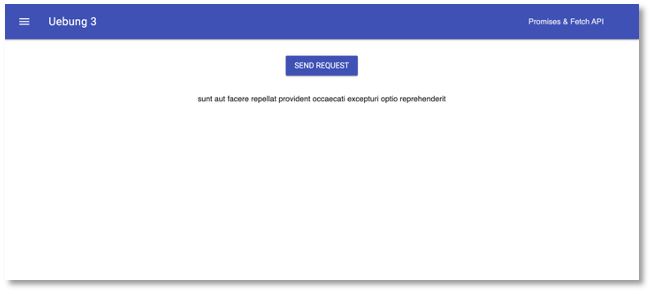
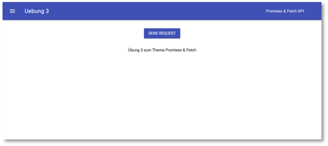

## Uebung 3

- Aufgabe in `public/src/js/app.js`
- kleine Übung zu [Promises und Fetch API](https://freiheit.f4.htw-berlin.de/ikt/promises/#promises-und-die-fetch-api)

## ToDo

- Projekt in der IDE öffnen --> `public/src/js/app.js` öffnen
- Im Projekt-Ordner `npm install` ausführen, um die Abhängigkeiten zu installieren
- Im Projekt-Ordner `npm start` ausführen
- Im Browser [localhost:8080](http://localhost:8080) öffnen (oder der entsprechend angezeigte Port)

## Ergebnis

- nach dem `GET` könnte die Seite z.B. so aussehen:

- nach dem `POST` könnte die Seite z.B. so aussehen:

